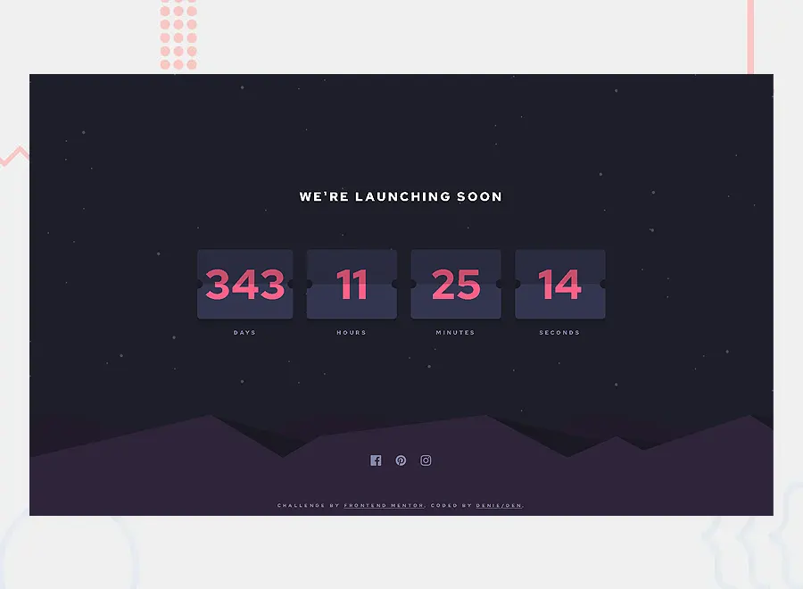

# Frontend Mentor - Launch countdown timer solution

This is a solution to the [Launch countdown timer challenge on Frontend Mentor](https://www.frontendmentor.io/challenges/launch-countdown-timer-N0XkGfyz-). Frontend Mentor challenges help you improve your coding skills by building realistic projects. 

## Table of contents

- [Overview](#overview)
  - [The challenge](#the-challenge)
  - [Screenshot](#screenshot)
  - [Links](#links)
- [My process](#my-process)
  - [Built with](#built-with)
  - [What I learned](#what-i-learned)
  - [Continued development](#continued-development)
- [Author](#author)

## Overview

### The challenge

Users should be able to:

- See hover states for all interactive elements on the page
- See a live countdown timer that ticks down every second (start the count at 14 days) - I set the count for New Year's
- **Bonus**: When a number changes, make the card flip from the middle

### Screenshot



### Links

- Solution URL: [github](https://github.com/denielden/react-countdown-timer)
- Live Site URL: [live site](https://denielden.github.io/react-countdown-timer)

## My process

### Built with

- Semantic HTML5 markup
- CSS custom properties
- Flexbox
- Mobile-first workflow
- [React](https://reactjs.org/) - JS library

### What I learned

I figured out how to create a countdown timer using React hooks.

```js
  useEffect(() => {
    const timer = setTimeout(() => {
        setTimeLeft(initTimeLeft());
    }, 1000);

    return () => clearTimeout(timer);
  });
```
However in the cards I was unable to turn them from the center when the number changes.

### Continued development

I'm trying to understand and learn how to make sure that when a number changes, it flips the card from the center.

If you have any feedback for me I would be very grateful :)

## Author

- Website - [denielden](https://denielden.github.io)
- Frontend Mentor - [@denielden](https://www.frontendmentor.io/profile/denielden)